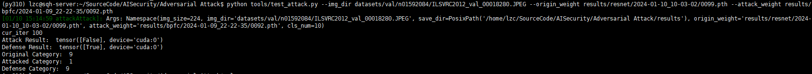

# AI Security-Attack&&Defense based on ImageNet

### Install requirements

> pytorch torchvision numpy pandas termcolor

### Generate Train/Test Datasets

`python scripts gen_sub_ds.py --origin_dir dirA --target_dir dirB`

This script generates subdatasets through the utilization of `ln -s`, which denotes the creation of soft links.

### Retrain Model

```shell
sh scripts/train_resnet.sh
```

Train a new model using the distributed data parallel (DDP) technique.

### Train BPFC

```shell
sh scripts/train_bpfc.sh
```

### Test

```shell
python tools/test_attack.py --img_dir <image_fp> --origin_weight <weight_fp> --attack_weight <weight_fp>
```

> `origin_weight` is obtained during the training of a new ResNet model.
>
> `attack_weight` is obtained during the training of the defense model.

### Result



### Citation

```
@InProceedings{Addepalli_2020_CVPR,
author = {Addepalli, Sravanti and B.S., Vivek and Baburaj, Arya and Sriramanan, Gaurang and Babu, R. Venkatesh},
title = {Towards Achieving Adversarial Robustness by Enforcing Feature Consistency Across Bit Planes},
booktitle = {Proceedings of the IEEE/CVF Conference on Computer Vision and Pattern Recognition (CVPR)},
month = {June},
year = {2020}
}
```

```text
@InProceedings{Moosavi-Dezfooli_2016_CVPR,
author = {Moosavi-Dezfooli, Seyed-Mohsen and Fawzi, Alhussein and Frossard, Pascal},
title = {DeepFool: A Simple and Accurate Method to Fool Deep Neural Networks},
booktitle = {Proceedings of the IEEE Conference on Computer Vision and Pattern Recognition (CVPR)},
month = {June},
year = {2016}
}
```